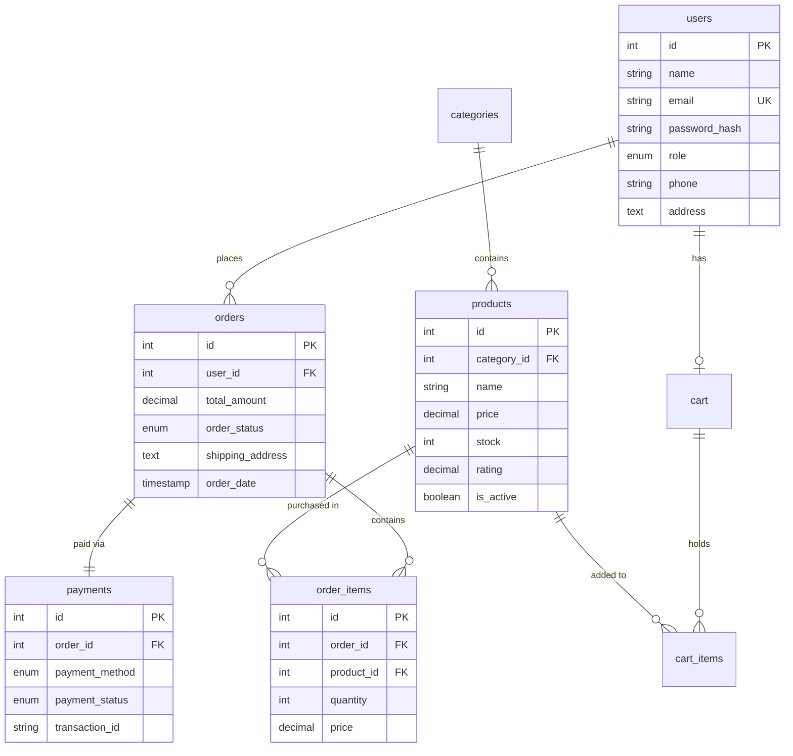
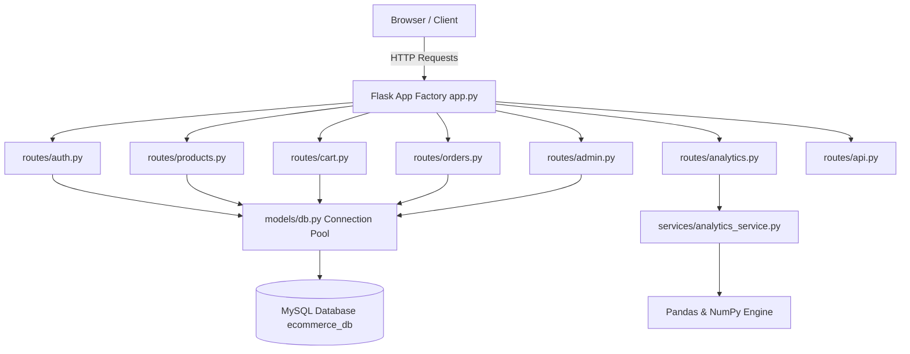

# 🛍️ ShopAnalytica — E-Commerce Sales & Customer Analytics Platform

> A full-stack, industry-style E-Commerce Web Application & Data Analytics Platform built with **Python, Flask, MySQL, Pandas, NumPy, Bootstrap 5, and Chart.js**.

[](https://www.python.org/)
[](https://flask.palletsprojects.com/)
[](https://www.mysql.com/)
[](https://pandas.pydata.org/)
[](https://numpy.org/)
[](https://getbootstrap.com/)
[](#license)

---

## 📌 Executive Summary

**ShopAnalytica** is a complete, production-grade e-commerce platform designed to demonstrate modern software engineering, database normalization, web security, and data analytics principles. It combines a feature-rich customer shopping experience with an advanced administration control panel and a **Pandas/NumPy-powered data analytics engine** delivering real-time business intelligence and interactive Chart.js visualizations.

---

## ✨ Key Features

### 🛒 Customer E-Commerce Storefront
- **Authentication & Profiles**: Secure registration, password hashing (`scrypt`), session login/logout, and profile management.
- **Product Catalog Browsing**: Search products by keyword (`LIKE`), filter by category, filter by price range, filter in-stock items, sort by 5 options, and paginated results (12 per page).
- **Product Detail View**: High-resolution image preview with automatic fallback, stock availability badges, star ratings, quantity picker, and category-related products.
- **Shopping Cart**: Database-backed cart persistence, real-time navbar badge updates, +/- quantity stepper, and out-of-stock guardrails.
- **Transactional Checkout**: Multi-step checkout supporting UPI, Credit/Debit Card, and Cash on Delivery with historical price snapshotting in `order_items`.
- **Order Tracking & History**: Customer order history with interactive lifecycle tracking progress bar (Pending → Confirmed → Shipped → Delivered) and atomic order cancellation with inventory restoration.

### 🛡️ Admin Management Control Center
- **Executive KPI Dashboard**: Live metrics for Total Revenue (₹), Total Orders, Active Customers, Active Products, and Low-Stock Warnings.
- **Product Management**: Full CRUD operations with image URL generation and soft-deletion (`is_active = FALSE`).
- **Category Management**: Two-column layout with edit modals and database foreign key protection (`ON DELETE RESTRICT`).
- **Order Management & State Machine**: Status filter tabs (All, Pending, Confirmed, Shipped, Delivered, Cancelled) and status update modal (automatic COD payment completion on delivery).
- **Customer Intelligence**: Customer directory featuring order counts and lifetime spend calculations.

### 📊 Data Analysis & Business Intelligence (Pandas & NumPy)
- **Time Series Revenue Trends**: Monthly revenue, order count, Average Order Value (AOV), and Month-over-Month (MoM) growth calculations using Pandas `.pct_change()`.
- **Customer Spend Segmentation**: Quantile-based customer profiling using NumPy `np.percentile()` (VIP High Spenders, Regular, Occasional).
- **Statistical Analytics**: Mean spend, Median spend, Standard Deviation (`np.std`), and revenue share percentages.
- **Interactive Visualizations**: 5 HTML5 Chart.js charts (Dual Y-Axis Line, Category Donut, Product Volume Bar, Customer Pie, Payment Method Bar).
- **Automated CSV Reports**: One-click export of live DataFrames to CSV files in `reports/generated_reports/`.

### 🔌 RESTful API & Security Hardening
- **REST API (`/api/v1/`)**: Programmatic JSON endpoints for `/health`, `/products`, `/categories`, `/analytics/summary`, and `/analytics/monthly-sales`.
- **Interactive API Documentation (`/api/v1/docs`)**: Swagger-style documentation with live JavaScript `fetch()` execution.
- **Security Headers**: `X-Content-Type-Options`, `X-Frame-Options`, `X-XSS-Protection`, `Referrer-Policy`, and `Content-Security-Policy`.
- **Session Security**: `SESSION_COOKIE_HTTPONLY = True`, `SESSION_COOKIE_SAMESITE = 'Lax'`.

---

## 🛠️ Technology Stack

| Domain | Technology | Purpose |
|--------|------------|---------|
| **Backend Framework** | Python 3.10+, Flask 3.0.3 | Web server, routing, Application Factory, Blueprints |
| **Database** | MySQL 8.0+, mysql-connector-python | Relational database, InnoDB engine, utf8mb4, connection pooling |
| **Data Analytics** | Pandas 2.2.2, NumPy 1.26.4 | DataFrames, statistical analysis, quantile profiling, CSV exports |
| **Frontend UI** | HTML5, Vanilla CSS3, JavaScript (ES6) | Responsive UI, custom CSS design system, toast notifications |
| **CSS Framework** | Bootstrap 5.3, Bootstrap Icons | Responsive grid, modals, navigation, components |
| **Data Visualization**| Chart.js 4.4 | Interactive HTML5 canvas charts |
| **Testing** | pytest 8.2 | Integration and unit testing suite |
| **Security** | Werkzeug | `scrypt` password hashing, input sanitization |
| **Production WSGI** | Gunicorn / Waitress / Nginx | Web Server Gateway Interface, reverse proxying |

---

## 📐 System Architecture & Diagrams

### 1. Database Entity-Relationship Diagram (ERD)



### 2. Component Architecture Diagram



---

## 🚀 Local Setup & Installation

### Step 1: Prerequisites
Ensure you have installed:
- **Python 3.10+** (`python --version`)
- **MySQL 8.0+** (`mysql --version`)
- **Git** (`git --version`)

### Step 2: Clone & Environment Setup
```powershell
# Clone repository
git clone https://github.com/your-username/shopanalytica.git
cd shopanalytica

# Create virtual environment
python -m venv venv

# Activate virtual environment (Windows)
.\venv\Scripts\activate

# Install dependencies
pip install -r requirements.txt
```

### Step 3: Database Initialization
```powershell
# Create database schema (8 tables, constraints, indexes)
mysql -u root -p < database/schema.sql

# Seed database with realistic Indian e-commerce data
python database/seed_data.py
```

### Step 4: Environment Configuration (`.env`)
Create a `.env` file in the root directory (or edit existing):
```env
DB_HOST=localhost
DB_USER=root
DB_PASSWORD=your_mysql_password
DB_NAME=ecommerce_db
SECRET_KEY=your_development_secret_key
FLASK_ENV=development
```

### Step 5: Run the Application
```powershell
python app.py
```
Open **http://127.0.0.1:5000** in your browser.

---

## 🔑 Demo Login Credentials

| Role | Email | Password | Access Level |
|------|-------|----------|--------------|
| **Admin** | `admin@ecommerce.com` | `Password@123` | Full Dashboard, Products, Categories, Orders, Analytics |
| **Customer** | `amit.patel@example.com` | `Password@123` | Catalog, Cart, Checkout, My Orders, Profile |

---

## 🧪 Test Suite Execution

Run automated test suite covering 30+ integration and unit tests:
```powershell
pytest
```

---

## 📁 Repository Directory Structure

```
shopanalytica/
├── .env                         # Environment variables (DB credentials)
├── .gitignore                   # Version control exclusions
├── config.py                    # Environment configuration classes
├── app.py                       # Application factory entry point
├── wsgi.py                      # WSGI production server entry point
├── Procfile                     # PaaS deployment startup configuration
├── requirements.txt             # Python dependencies
├── SECURITY.md                  # Security architecture documentation
├── database/
│   ├── schema.sql               # MySQL database schema (8 tables)
│   └── seed_data.py             # Realistic Indian e-commerce data generator
├── deploy/
│   ├── gunicorn.conf.py         # Production Gunicorn worker process configuration
│   └── nginx.conf               # Nginx reverse proxy & SSL template
├── models/
│   ├── db.py                    # MySQL connection pool & execute_query helper
│   ├── user.py                  # User model & customer queries
│   ├── product.py               # Product model & dynamic search pagination
│   ├── category.py              # Category CRUD model
│   ├── cart.py                  # Shopping cart model & stock validation
│   ├── order.py                 # Atomic checkout transactions & status management
│   └── admin.py                 # Executive KPI summary model
├── services/
│   ├── auth_service.py          # Password hashing & input validation
│   └── analytics_service.py     # Pandas DataFrames & NumPy statistics engine
├── routes/
│   ├── auth.py                  # Authentication blueprint (/auth/*)
│   ├── products.py              # Customer products blueprint (/products/*)
│   ├── cart.py                  # Shopping cart blueprint (/cart/*)
│   ├── orders.py                # Orders & checkout blueprint (/orders/*)
│   ├── admin.py                 # Admin management blueprint (/admin/*)
│   ├── analytics.py             # Business intelligence blueprint (/analytics/*)
│   └── api.py                   # REST API blueprint (/api/v1/*)
├── utils/
│   ├── decorators.py            # @login_required & @admin_required decorators
│   └── security.py              # Security response headers middleware
├── templates/
│   ├── base.html                # Base layout with navbar, flash alerts, footer
│   ├── index.html               # Homepage with live DB stats & categories
│   ├── api_docs.html            # Interactive API documentation page
│   ├── auth/                    # Login, Register, Profile views
│   ├── products/                # Product catalog & Detail views
│   ├── cart/                    # Shopping cart view
│   ├── orders/                  # Checkout, Receipt, History, Detail views
│   ├── admin/                   # Dashboard, Products, Categories, Orders views
│   ├── analytics/               # Interactive Chart.js overview dashboard
│   └── errors/                  # Custom 404 & 500 pages
├── static/
│   ├── css/style.css            # 650+ line custom CSS design system
│   └── js/script.js             # Utility scripts, toasts, quantity steppers
├── tests/                       # Pytest automated test suite (30+ tests)
└── reports/
    └── generated_reports/       # Output folder for exported CSV reports
```

---

## 📄 Resume & Interview Bullet Points

- **Full-Stack Architecture**: Built a modular, production-ready Flask application using the Application Factory pattern, Blueprints, and a custom CSS design system based on Bootstrap 5.
- **Database Engineering**: Designed a 3NF normalized MySQL database with 8 tables, foreign key constraints (`CASCADE`/`RESTRICT`), indexes on high-frequency query columns, and CHECK constraints.
- **Data Analytics Engine**: Developed a business intelligence module utilizing **Pandas** DataFrames and **NumPy** for calculating Month-over-Month (MoM) growth rates, quantile customer spend segmentation, and statistical summaries.
- **Data Visualization**: Integrated **Chart.js** to render 5 interactive HTML5 canvas charts dynamically powered by Flask context serialization.
- **Transactional Integrity**: Implemented atomic SQL transactions for order checkout and cancellation to guarantee stock deduction accuracy and prevent data corruption.
- **RESTful API**: Designed a `/api/v1/` JSON API featuring HTTP status codes, uniform response envelopes, query parameter filtering, and an interactive documentation page with live JavaScript `fetch()` execution.
- **Web Security**: Applied Werkzeug `scrypt` password hashing, parameterized SQL queries against injection, `HttpOnly`/`SameSite` session cookies, and HTTP security headers (`Content-Security-Policy`, `X-Frame-Options`).

---

## 📜 License

Distributed under the MIT License. See `LICENSE` for details.
